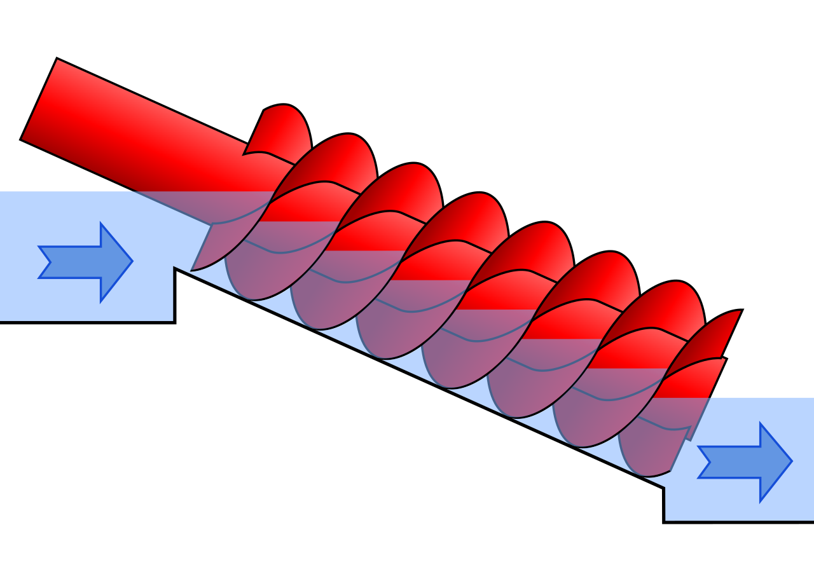

# Archimedean Screw Blade Generator (Fusion 360)

## The frustration that started this
I had already built the shaft.
Then I got stuck on the blade, because the blade is the math-heavy part of an Archimedean screw: helical geometry, pitch, handedness, start angle, and keeping it manufacturable.
This add-in exists so that part is no longer a manual sketch nightmare.

## What this add-in does
- Builds configurable Archimedean screw blade geometry around an existing shaft.
- Lets you select your shaft face and a start plane, then generate one or multiple flights.
- Supports `New Body` or direct `Join` into your shaft.

## Configurable parameters
- `Outer Radius`
- `Blade Length`
- `Turns`
- `Blade Thickness`
- `Hub Clearance`
- `Start Angle`
- `Handedness` (left/right)
- `Flights` (multi-start screw)
- `Segments / Turn` (smoothness)

## Installation
1. Open Fusion 360.
2. Go to `Utilities -> Add-Ins -> Scripts and Add-Ins`.
3. In the `Add-Ins` tab, click `+`.
4. Select folder: `ArchimedeanScrewBladeGenerator`.
5. Run `Archimedean Screw Blade` from the `Create` panel.

## Project layout
- `ArchimedeanScrewBladeGenerator/ArchimedeanScrewBladeGenerator.py`: add-in command and geometry generation.
- `ArchimedeanScrewBladeGenerator/ArchimedeanScrewBladeGenerator.manifest`: Fusion add-in manifest.
- `ArchimedeanScrewBladeGenerator/resources/`: toolbar icons.
- `ArchimedeanScrewBladeGenerator/assets/prompt-reference.png`: reference screw diagram.

## Cross-reference used before publish
I cross-referenced your local Fusion add-in `HelixGenerator` at:
`%APPDATA%\Autodesk\Autodesk Fusion 360\API\AddIns\HelixGenerator\HelixGenerator`
and aligned this repo with common Fusion add-in patterns:
- add-in manifest + main Python entrypoint
- toolbar resource icon set (`16/32/64`, dark, disabled)
- installation-focused README documentation

## Reference image attribution
Diagram source: Wikimedia Commons (`ArchimedesSketch.svg`).
